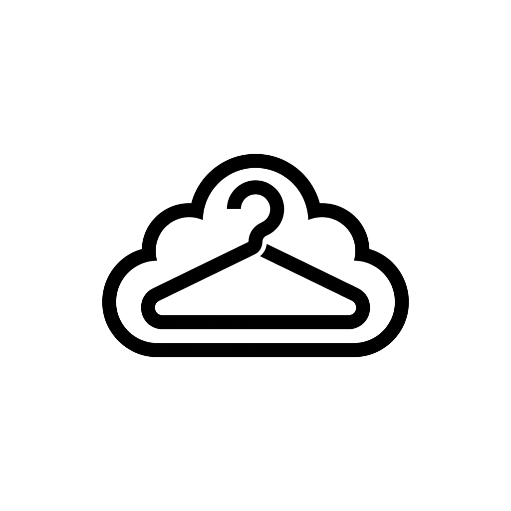

<div align="center">
  
  
  <h1>🛍️ DP-NubeStore Ecommerce</h1>
  <p><strong>Plataforma de comercio electrónico con diseño editorial premium y arquitectura limpia.</strong></p>

  <p>
    
    
    
    
  </p>
</div>

---

## 📖 Sobre el Proyecto

**NubeStore** es un proyecto universitario desarrollado con un enfoque estricto en buenas prácticas de ingeniería de software. 

Se optó por una arquitectura sin frameworks en el frontend (Cero Bootstrap/Tailwind) para demostrar dominio de los estándares web actuales (CSS Grid, Flexbox, Custom Properties), y un backend transaccional en Java usando **JDBC puro** (sin ORMs) para un control absoluto sobre el rendimiento y las consultas SQL.

---

## 🏗️ Arquitectura del Monorepo

Este repositorio está estructurado como un **Monorepo**, dividiendo claramente las responsabilidades entre el cliente y el servidor. Cada capa cuenta con su propia documentación detallada:

<table>
  <tr>
    <td align="center" width="50%">
      <h3>⚙️ Backend</h3>
      <p>API RESTful robusta construida con Java Spring Boot y persistencia directa vía JDBC.</p>
      <a href="./backend/README.md"><b>Ver Documentación del Backend →</b></a>
    </td>
    <td align="center" width="50%">
      <h3>🎨 Frontend</h3>
      <p>Interfaz de usuario interactiva y responsive construida con HTML5, CSS3 y Vanilla JS.</p>
      <a href="./frontend/README.md"><b>Ver Documentación del Frontend →</b></a>
    </td>
  </tr>
</table>

---

## 🚀 Características Destacadas

### 🔒 Backend
- **Cero ORM:** Transacciones SQL controladas manualmente (ACID).
- **Seguridad:** Encriptación de contraseñas con `BCrypt` y mitigación de ataques de enumeración.
- **Lógica de Base de Datos:** Uso avanzado de `CHECK`, `UNIQUE` y columnas autogeneradas en PostgreSQL.
- **Patrones de Diseño:** Implementación estricta de SOLID, Singleton, Factory y GRASP.

### ✨ Frontend
- **Diseño a Medida:** Estética premium "estilo editorial" inspirada en grandes marcas.
- **Responsive Nativo:** Layout adaptable mediante *Media Queries*, sin clases prefabricadas.
- **Modo Oscuro:** Tema dinámico persistente gestionado por variables CSS nativas.
- **Componentes Custom:** Modales, Toasts y menús *off-canvas* desarrollados desde cero con DOM puro.

---

## ⚙️ Configuración Rápida

Si deseas levantar el proyecto completo en tu entorno local, sigue estos pasos:

1. **Clona el repositorio:**
   ```bash
   git clone https://github.com/TuUsuario/DP-NubeStore-Ecommerce.git
   cd DP-NubeStore-Ecommerce
